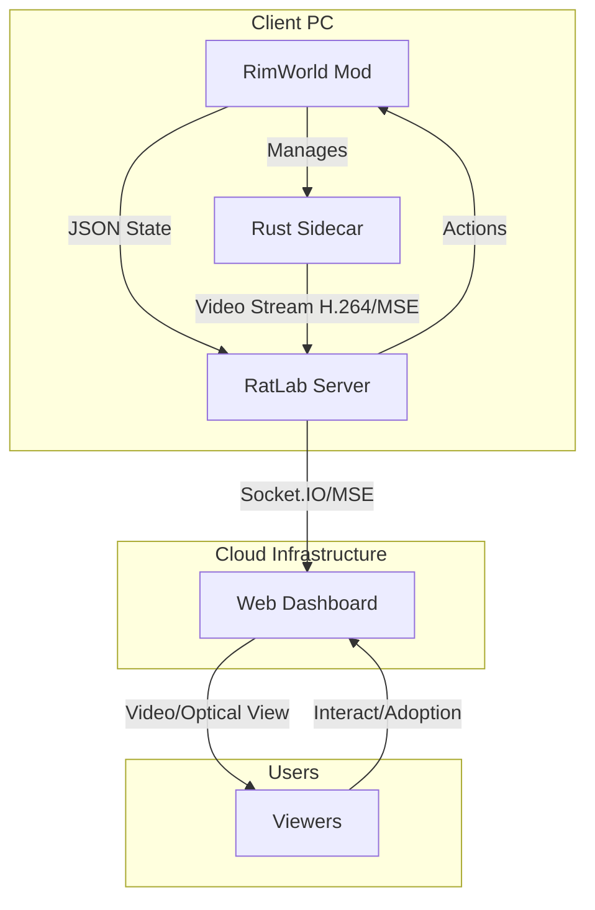

# RatLab Architecture

## System Overview

RatLab (formerly PlayerStoryteller) replaces the old embedded server architecture with a modern, cloud-connected client-server model. The system consists of three main components working in tandem to provide a low-latency, interactive streaming experience.

## Components

### 1. The Mod (Client)
**Language:** C# (.NET Framework 4.7.2)
**Location:** `Ratlab Mod/`

The mod acts as a telemetry agent and controller. It does **not** host a local server.
*   **Triple-Tier Data Polling:**
    *   **Ultrafast (10Hz):** Direct memory access for Pawn IDs/Positions. Used for Optical interpolation.
    *   **Fast (1Hz):** `GenRadial` scan of visible Terrain, Buildings, and Items for the Optical View.
    *   **Slow (5s+):** Deep scan of Skills, Needs, Gear, and World Stats.
*   **Action Execution:** Polls the server for queued viewer actions (e.g., "Spawn Raid", "Send Gift") and executes them in-game on the main thread.
*   **Sidecar Management:** Automatically launches and monitors the Rust sidecar process for video streaming.

### 2. The Sidecar (Streaming)
**Language:** Rust (2021 Edition)
**Location:** `rust-sidecar/`

A high-performance external process responsible for zero-overhead video capture.
*   **Window Capture:** Uses Windows Graphics Capture API for efficient frame grabbing.
*   **Encoding:** Native H.264 encoding with hardware acceleration support:
    *   NVIDIA NVENC (GPU-based, zero CPU impact)
    *   AMD AMF (GPU-based)
    *   Intel QSV (GPU-based)
    *   CPU fallback if GPU unavailable
*   **Transport:** Streams MSE-compatible H.264 segments via WebSocket to the Relay Server.
*   **Parent Monitoring:** Automatically exits when RimWorld process terminates.

### 3. The Server (Relay & Web Host)
**Language:** Node.js (Express + Socket.IO)
**Location:** `Ratlab Server/`

The central hub for data synchronization.
*   **State Relay:** Receives compressed game state from the Mod and broadcasts it to connected web clients via Socket.IO.
*   **Optical View Engine (Frontend):**
    *   **MapRenderer.js:** Custom Canvas 2D engine that renders the game world using textures.
    *   **Sub-Pixel Scrolling:** Smooth camera tracking locked to interpolated pawn positions.
    *   **Texture Caching:** Uses IndexedDB to cache RimWorld textures, minimizing bandwidth.
*   **Action Queue:** Manages an economy system and action queue for viewer interactions.

## Data Flow

### 1. Game State (Telemetry)
1.  **Poll:** Mod collects data based on tier (Fast/Slow).
2.  **Pack:** Data serialized to JSON (optimized with `Newtonsoft.Json`).
3.  **Send:** HTTP POST or WSS to `https://ratlab.online/api/update`.
4.  **Broadcast:** Server unpacks and emits `gamestate-update` event to browsers.
5.  **Render:** Web Dashboard updates DOM (React/Vanilla JS) and Canvas (Optical View).

### 2. Video Stream
1.  **Capture:** Sidecar grabs frame from window `HWND`.
2.  **Encode:** FFmpeg encodes to H.264.
3.  **Transmit:** Sidecar sends binary data to Server via WebSocket.
4.  **Relay:** Server forwards data to Viewers.
5.  **Decode:** Browser decodes using MSE (Media Source Extensions).

### 3. Viewer Actions & Adoptions
1.  **Trigger:** Viewer clicks "Heal Colonist" or "Adopt".
2.  **Queue:** Server checks economy balance, adds to Action Queue.
3.  **Fetch:** Mod polls `/api/actions` (or receives via WebSocket).
4.  **Execute:** Mod runs C# code to heal the pawn or register the adoption on the next game tick.
