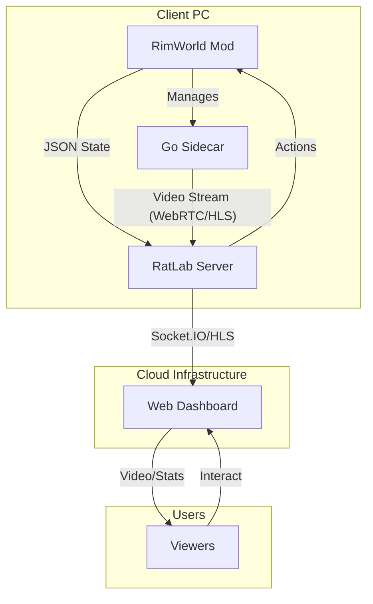

# RatLab Architecture

## System Overview

RatLab (formerly PlayerStoryteller) replaces the old embedded server architecture with a modern, cloud-connected client-server model. The system consists of three main components working in tandem to provide a low-latency, interactive streaming experience.

```mermaid
graph TD
    subgraph Client PC
        A[RimWorld Mod] -- JSON State --> D[Cloud Server]
        A -- Manages --> B[Go Sidecar]
        B -- Video Stream (WebRTC/HLS) --> D
    end

    subgraph Cloud Infrastructure
        D[RatLab Server] -- Socket.IO/HLS --> E[Web Dashboard]
        D -- Actions --> A
    end

    subgraph Users
        F[Viewers] -- Interact --> E
        E -- Video/Stats --> F
    end
```

## Components

### 1. The Mod (Client)
**Language:** C# (.NET Framework 4.7.2)
**Location:** `Ratlab Mod/`

The mod acts as a telemetry agent and controller. It does **not** host a local server.
*   **Data Polling:** Periodically scans game state (Colonists, Needs, Inventory, Map, Wealth).
*   **Compression:** Compresses JSON payloads (GZip) before sending to the server.
*   **Action Execution:** Polls the server for queued viewer actions (e.g., "Spawn Raid", "Send Gift") and executes them in-game on the main thread.
*   **Sidecar Management:** Automatically launches and monitors the `go-sidecar` process for video streaming.

### 2. The Sidecar (Streaming)
**Language:** Go (Golang)
**Location:** `go-sidecar/`

A lightweight external process responsible for high-performance video capture.
*   **Window Capture:** Captures the RimWorld window directly using Windows APIs (GDI/DirectX).
*   **Encoding:** Pipes raw frames to an embedded **FFmpeg** instance.
    *   Supports Hardware Acceleration: NVIDIA (NVENC), AMD (AMF), Intel (QSV).
    *   Falls back to CPU (libx264) if hardware encoding fails.
*   **Transport:** Streams H.264 video segments via WebSocket to the Relay Server.

### 3. The Server (Relay & Web Host)
**Language:** Node.js (Express + Socket.IO)
**Location:** `Ratlab Server/`

The central hub for data synchronization.
*   **State Relay:** Receives compressed game state from the Mod and broadcasts it to connected web clients via Socket.IO.
*   **Stream Distribution:**
    *   **Low Latency:** Relays WebSocket video packets for real-time viewing.
    *   **High Scalability:** Can output to HLS/CDN for mass audiences.
*   **Action Queue:** Manages an economy system and action queue for viewer interactions.
*   **Dashboard:** Serves the Single Page Application (SPA) web interface.

## Data Flow

### 1. Game State (Telemetry)
1.  **Poll:** Mod collects data (e.g., `Colonist.health`).
2.  **Pack:** Data serialized to JSON and GZipped.
3.  **Send:** HTTP POST to `https://ratlab.online/api/update`.
4.  **Broadcast:** Server unpacks and emits `gamestate-update` event to browsers.
5.  **Render:** Web Dashboard updates DOM (React/Vanilla JS).

### 2. Video Stream
1.  **Capture:** Sidecar grabs frame from window `HWND`.
2.  **Encode:** FFmpeg encodes to H.264.
3.  **Transmit:** Sidecar sends binary data to Server via WebSocket.
4.  **Relay:** Server forwards data to Viewers.
5.  **Decode:** Browser decodes using MSE (Media Source Extensions).

### 3. Viewer Actions
1.  **Trigger:** Viewer clicks "Heal Colonist" on Dashboard.
2.  **Queue:** Server checks economy balance, adds to Action Queue.
3.  **Fetch:** Mod polls `/api/actions` (or receives via WebSocket).
4.  **Execute:** Mod runs C# code to heal the pawn on the next game tick.